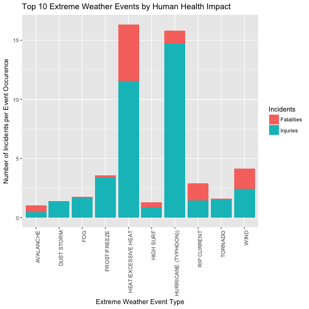

##Synopsis
Our analysis on the NOAA storm database begins with a quick cleanup of the data, which contained more than 900 different classifiers for storm event types, when there should only be 48. From there, we broke the data into two sets for analysis on health and economic impact respectively. We found that hurricanes are mutually threatening, having a high impact on human health and economic outcomes per event occurence. Other events differed (i.e. heat has a large human health impact but little economic impact and floods have a significantly higher economic impact than human health). The purpose of this analysis was to provide tables and figures that would allow officials to make decisions on extreme weather event preparations. 

##Loading and Processing the Raw Data
This data has been provided by the U.S. National Oceanic and Atmospheric Administration's (NOAA) storm database. It can be found [here](https://d396qusza40orc.cloudfront.net/repdata%2Fdata%2FStormData.csv.bz2). The supporting data documentation can be found in National Weather Service Instruction document located [here](https://d396qusza40orc.cloudfront.net/repdata%2Fpeer2_doc%2Fpd01016005curr.pdf).

###Reading in the Data

```r
dataUrl <- "https://d396qusza40orc.cloudfront.net/repdata%2Fdata%2FStormData.csv.bz2"

if(!file.exists("./data")){dir.create("./data")}
if(!file.exists("./data/NOAA_storm_data.zip")){
  download.file(dataUrl,destfile="./data/NOAA_storm_data.zip")}
if(!exists("NOAAdata")){
                NOAAdata <- read.csv("./data/NOAA_storm_data.zip",header=TRUE,sep=",")}
dim(NOAAdata)
```

```
## [1] 902297     37
```

```r
head(NOAAdata)
```

```
##   STATE__           BGN_DATE    BGN_TIME TIME_ZONE COUNTY COUNTYNAME STATE
## 1      60  12/3/2001 0:00:00 09:00:00 AM       SST      2    TUTUILA    AS
## 2      34 12/13/1996 0:00:00 11:00:00 AM       EST     17     HUDSON    NJ
## 3      48   4/2/2000 0:00:00 04:20:00 AM       CST    201     HARRIS    TX
## 4       4  8/24/1998 0:00:00 03:00:00 PM       MST     25    YAVAPAI    AZ
## 5      13  7/16/1997 0:00:00 01:53:00 PM       EST     51    CHATHAM    GA
## 6      13  8/20/1999 0:00:00 07:44:00 PM       EST     51    CHATHAM    GA
##                  EVTYPE BGN_RANGE BGN_AZI         BGN_LOCATI
## 1    HIGH SURF ADVISORY         0                 COUNTYWIDE
## 2         COASTAL FLOOD         0                      COAST
## 3           FLASH FLOOD         0          NORTHWEST PORTION
## 4             LIGHTNING         0                   PRESCOTT
## 5             TSTM WIND         0                THUNDERBOLT
## 6             TSTM WIND         0         SAVANNAH MUNI ARPT
##             END_DATE    END_TIME COUNTY_END COUNTYENDN END_RANGE END_AZI
## 1  12/7/2001 0:00:00 03:00:00 AM          0         NA         0        
## 2 12/13/1996 0:00:00 01:00:00 PM          0         NA         0        
## 3   4/2/2000 0:00:00 06:00:00 AM          0         NA         0        
## 4  8/24/1998 0:00:00 03:00:00 PM          0         NA         0        
## 5  7/16/1997 0:00:00 02:00:00 PM          0         NA         0        
## 6  8/20/1999 0:00:00 07:44:00 PM          0         NA         0        
##           END_LOCATI LENGTH WIDTH  F MAG FATALITIES INJURIES PROPDMG
## 1         COUNTYWIDE      0     0 NA   0          0        0     200
## 2              COAST      0     0 NA   0          0        0       0
## 3  NORTHWEST PORTION      0     0 NA   0          0        0      50
## 4           PRESCOTT      0     0 NA   0          0        0       0
## 5        THUNDERBOLT      0     0 NA  50          0        0       0
## 6 SAVANNAH MUNI ARPT      0     0 NA  52          0        0       0
##   PROPDMGEXP CROPDMG CROPDMGEXP WFO                     STATEOFFIC
## 1          K       0            ASO                 AMERICAN SAMOA
## 2                  0            OKX          NEW JERSEY, Northeast
## 3          K       0            HGX       TEXAS, Central Southeast
## 4                  0            FGZ ARIZONA, Central and Northeast
## 5                  0            CHS             GEORGIA, Southeast
## 6                  0            CHS             GEORGIA, Southeast
##   ZONENAMES LATITUDE LONGITUDE LATITUDE_E LONGITUDE_
## 1                  0         0          0          0
## 2                  0         0          0          0
## 3                  0         0          0          0
## 4                  0         0          0          0
## 5                  0         0          0          0
## 6                  0         0          0          0
##                                                                                                                                                                                                                                                                                                                                                                                                                                                                                                                                                                                                                                REMARKS
## 1                                                           High surf generated by an intense low pressure area far south of Samoa washed out a temporary access road at Avau  Point which cost about $200,000.00 to construct.  This access road was constructed to divert traffic to allow the Department of Public Works to make permament fixutre to the road damage by lad slide casued the the heavy showers in November.  The exceptionally high surf were reported through out the south shores of the Tutuila.  No othelr major damages were reported besides debris being washed onto the roads along lower coastal areas.\n
## 2   \nA low pressure system developed off the Virginia Coast during Friday, December 13th.  It rapidly intensified as it moved slowly east out to sea during Saturday, December 14th.\n\nPersistent Northeast Winds averaging 20 to 30 MPH combined with high astronomical tides and tide anomalies of 2 to 2 1/2 feet above normal at Sandy Hook, NJ and the Battery, NY; caused minor to locally moderate coastal flooding along parts of the Hudson County coastline.  Tidal flooding occurred around high tide and inundated parts of the Bellville Turnpike in Kearny.  This low also produced 1.18 inches of rain at Kearny.\n\n
## 3                                                                                                                                                                                                                                          Significant over curb flooding in the Silverstone and Creekstone subdivisions along Mason Rd.\n\nAn upper level disturbance spawned a large cluster of thunderstorms over the southern half of southeast Texas in the early morning of April 2nd.  Harris, Liberty, and Montgomery counties were hardest hit with widespread reports of large hail, downburst wind damage and flooding.\n\n
## 4                                                                                                                                                                                                                                                                                                                     An isolated thunderstorm dropped heavy rain over downtown Prescott. Doppler radar estimates of 2 to 3 inches of rain fall in two hours caused widespread street flooding. Water rose just above curb level and seeped into a few downtown businesses. Lightning struck two homes, causing minor damage to one.\n
## 5                                                                                                                                                                                                                                                                                                                                                                                                                                                                                                                                                                                                              Several trees down.\n\n
## 6                                                                                                                                                                                                                                                                                                                                                                                                                                                                                                                                                                                Airport tower personnel reported 52 knot wind gust.\n
##   REFNUM
## 1 448421
## 2 265763
## 3 408333
## 4 311043
## 5 286025
## 6 354064
```

###Processing the Raw Data
First, let's clean up the data. There are 48 valid Storm Data Event listed in the [NWSI supporting documentation](https://d396qusza40orc.cloudfront.net/repdata%2Fpeer2_doc%2Fpd01016005curr.pdf) on page 6 in table 2.1.1.


```r
str(NOAAdata)
```

```
## 'data.frame':	902297 obs. of  37 variables:
##  $ STATE__   : num  60 34 48 4 13 13 17 13 12 12 ...
##  $ BGN_DATE  : Factor w/ 16335 levels "1/1/1966 0:00:00",..: 3611 3127 6668 14028 11685 13798 10923 12155 819 11630 ...
##  $ BGN_TIME  : Factor w/ 3608 levels "00:00:00 AM",..: 1563 1923 702 483 229 1292 1134 543 1923 573 ...
##  $ TIME_ZONE : Factor w/ 22 levels "ADT","AKS","AST",..: 20 10 7 16 10 10 7 10 10 10 ...
##  $ COUNTY    : num  2 17 201 25 51 51 191 121 71 87 ...
##  $ COUNTYNAME: Factor w/ 29601 levels "","5NM E OF MACKINAC BRIDGE TO PRESQUE ISLE LT MI",..: 24421 6034 5749 29578 2826 2826 27268 5021 10334 13526 ...
##  $ STATE     : Factor w/ 72 levels "AK","AL","AM",..: 6 44 63 7 14 14 20 14 13 13 ...
##  $ EVTYPE    : Factor w/ 985 levels "   HIGH SURF ADVISORY",..: 1 2 3 4 5 5 5 5 6 7 ...
##  $ BGN_RANGE : num  0 0 0 0 0 0 0 0 1 0 ...
##  $ BGN_AZI   : Factor w/ 35 levels "","  N"," NW",..: 1 1 1 1 1 1 1 1 17 1 ...
##  $ BGN_LOCATI: Factor w/ 54429 levels ""," Christiansburg",..: 11211 10129 35139 39661 48636 43182 16045 10392 17804 13574 ...
##  $ END_DATE  : Factor w/ 6663 levels "","1/1/1993 0:00:00",..: 2184 1756 3554 5865 5138 5794 4906 5285 552 5124 ...
##  $ END_TIME  : Factor w/ 3647 levels ""," 0900CST",..: 441 128 901 442 284 1137 1012 502 1673 630 ...
##  $ COUNTY_END: num  0 0 0 0 0 0 0 0 0 0 ...
##  $ COUNTYENDN: logi  NA NA NA NA NA NA ...
##  $ END_RANGE : num  0 0 0 0 0 0 0 0 1 0 ...
##  $ END_AZI   : Factor w/ 24 levels "","E","ENE","ESE",..: 1 1 1 1 1 1 1 1 10 1 ...
##  $ END_LOCATI: Factor w/ 34506 levels ""," CANTON"," TULIA",..: 7363 6656 22428 25184 30763 27411 10404 10391 11538 8913 ...
##  $ LENGTH    : num  0 0 0 0 0 0 0 0 0 0 ...
##  $ WIDTH     : num  0 0 0 0 0 0 0 0 0 0 ...
##  $ F         : int  NA NA NA NA NA NA NA NA NA NA ...
##  $ MAG       : num  0 0 0 0 50 52 69 0 0 0 ...
##  $ FATALITIES: num  0 0 0 0 0 0 0 0 0 0 ...
##  $ INJURIES  : num  0 0 0 0 0 0 0 0 0 0 ...
##  $ PROPDMG   : num  200 0 50 0 0 0 100 8 8 0 ...
##  $ PROPDMGEXP: Factor w/ 19 levels "","-","?","+",..: 17 1 17 1 1 1 17 19 17 1 ...
##  $ CROPDMG   : num  0 0 0 0 0 0 0 0 0 0 ...
##  $ CROPDMGEXP: Factor w/ 9 levels "","?","0","2",..: 1 1 1 1 1 1 1 1 1 1 ...
##  $ WFO       : Factor w/ 542 levels ""," CI","%SD",..: 91 392 250 211 141 141 405 209 505 205 ...
##  $ STATEOFFIC: Factor w/ 250 levels "","ALABAMA, Central",..: 10 153 209 11 56 56 73 54 50 46 ...
##  $ ZONENAMES : Factor w/ 25112 levels "","                                                                                                               "| __truncated__,..: 1 1 1 1 1 1 1 1 1 1 ...
##  $ LATITUDE  : num  0 0 0 0 0 0 0 0 0 0 ...
##  $ LONGITUDE : num  0 0 0 0 0 0 0 0 0 0 ...
##  $ LATITUDE_E: num  0 0 0 0 0 0 0 0 0 0 ...
##  $ LONGITUDE_: num  0 0 0 0 0 0 0 0 0 0 ...
##  $ REMARKS   : Factor w/ 436781 levels "","\t","\t\t",..: 295955 3141 362291 59994 354001 55402 332736 375839 44228 312808 ...
##  $ REFNUM    : num  448421 265763 408333 311043 286025 ...
```

When we run the str function on EVTYPE we can see that there are 985 different classifiers actually being used in the observations. Eek. That's a lot of clean-up. Let's get started. 

Since we're only concerned with the most influential events, for the purpose of this assignment we will do a quick and "dirty" clean-up with some big generalizations. However, were this for a client, we would have to go through hundreds of questionable events line-by-line and read the notes to determine which of the 48 buckets it most closely falls into instead of making blanket assumptions and leaving some uncategorized. For example, would an event listed as simply "FOG" fall into "DENSE FOG" or "FREEZING FOG"?


```r
library(dplyr)
NOAAdata <- arrange(NOAAdata, EVTYPE)
unique(NOAAdata$EVTYPE)
```

```
##   [1]    HIGH SURF ADVISORY           COASTAL FLOOD                
##   [3]  FLASH FLOOD                    LIGHTNING                    
##   [5]  TSTM WIND                      TSTM WIND (G45)              
##   [7]  WATERSPOUT                     WIND                         
##   [9] ?                              ABNORMAL WARMTH               
##  [11] ABNORMALLY DRY                 ABNORMALLY WET                
##  [13] ACCUMULATED SNOWFALL           AGRICULTURAL FREEZE           
##  [15] APACHE COUNTY                  ASTRONOMICAL HIGH TIDE        
##  [17] ASTRONOMICAL LOW TIDE          AVALANCE                      
##  [19] AVALANCHE                      BEACH EROSIN                  
##  [21] Beach Erosion                  BEACH EROSION                 
##  [23] BEACH EROSION/COASTAL FLOOD    BEACH FLOOD                   
##  [25] BELOW NORMAL PRECIPITATION     BITTER WIND CHILL             
##  [27] BITTER WIND CHILL TEMPERATURES Black Ice                     
##  [29] BLACK ICE                      BLIZZARD                      
##  [31] BLIZZARD AND EXTREME WIND CHIL BLIZZARD AND HEAVY SNOW       
##  [33] Blizzard Summary               BLIZZARD WEATHER              
##  [35] BLIZZARD/FREEZING RAIN         BLIZZARD/HEAVY SNOW           
##  [37] BLIZZARD/HIGH WIND             BLIZZARD/WINTER STORM         
##  [39] BLOW-OUT TIDE                  BLOW-OUT TIDES                
##  [41] BLOWING DUST                   blowing snow                  
##  [43] Blowing Snow                   BLOWING SNOW                  
##  [45] BLOWING SNOW & EXTREME WIND CH BLOWING SNOW- EXTREME WIND CHI
##  [47] BLOWING SNOW/EXTREME WIND CHIL BREAKUP FLOODING              
##  [49] BRUSH FIRE                     BRUSH FIRES                   
##  [51] COASTAL  FLOODING/EROSION      COASTAL EROSION               
##  [53] Coastal Flood                  COASTAL FLOOD                 
##  [55] coastal flooding               Coastal Flooding              
##  [57] COASTAL FLOODING               COASTAL FLOODING/EROSION      
##  [59] Coastal Storm                  COASTAL STORM                 
##  [61] COASTAL SURGE                  COASTAL/TIDAL FLOOD           
##  [63] COASTALFLOOD                   COASTALSTORM                  
##  [65] Cold                           COLD                          
##  [67] COLD AIR FUNNEL                COLD AIR FUNNELS              
##  [69] COLD AIR TORNADO               Cold and Frost                
##  [71] COLD AND FROST                 COLD AND SNOW                 
##  [73] COLD AND WET CONDITIONS        Cold Temperature              
##  [75] COLD TEMPERATURES              COLD WAVE                     
##  [77] COLD WEATHER                   COLD WIND CHILL TEMPERATURES  
##  [79] COLD/WIND CHILL                COLD/WINDS                    
##  [81] COOL AND WET                   COOL SPELL                    
##  [83] CSTL FLOODING/EROSION          DAM BREAK                     
##  [85] DAM FAILURE                    Damaging Freeze               
##  [87] DAMAGING FREEZE                DEEP HAIL                     
##  [89] DENSE FOG                      DENSE SMOKE                   
##  [91] DOWNBURST                      DOWNBURST WINDS               
##  [93] DRIEST MONTH                   Drifting Snow                 
##  [95] DROUGHT                        DROUGHT/EXCESSIVE HEAT        
##  [97] DROWNING                       DRY                           
##  [99] DRY CONDITIONS                 DRY HOT WEATHER               
## [101] DRY MICROBURST                 DRY MICROBURST 50             
## [103] DRY MICROBURST 53              DRY MICROBURST 58             
## [105] DRY MICROBURST 61              DRY MICROBURST 84             
## [107] DRY MICROBURST WINDS           DRY MIRCOBURST WINDS          
## [109] DRY PATTERN                    DRY SPELL                     
## [111] DRY WEATHER                    DRYNESS                       
## [113] DUST DEVEL                     Dust Devil                    
## [115] DUST DEVIL                     DUST DEVIL WATERSPOUT         
## [117] DUST STORM                     DUST STORM/HIGH WINDS         
## [119] DUSTSTORM                      EARLY FREEZE                  
## [121] Early Frost                    EARLY FROST                   
## [123] EARLY RAIN                     EARLY SNOW                    
## [125] Early snowfall                 EARLY SNOWFALL                
## [127] Erosion/Cstl Flood             EXCESSIVE                     
## [129] Excessive Cold                 EXCESSIVE HEAT                
## [131] EXCESSIVE HEAT/DROUGHT         EXCESSIVE PRECIPITATION       
## [133] EXCESSIVE RAIN                 EXCESSIVE RAINFALL            
## [135] EXCESSIVE SNOW                 EXCESSIVE WETNESS             
## [137] EXCESSIVELY DRY                Extended Cold                 
## [139] Extreme Cold                   EXTREME COLD                  
## [141] EXTREME COLD/WIND CHILL        EXTREME HEAT                  
## [143] EXTREME WIND CHILL             EXTREME WIND CHILL/BLOWING SNO
## [145] EXTREME WIND CHILLS            EXTREME WINDCHILL             
## [147] EXTREME WINDCHILL TEMPERATURES EXTREME/RECORD COLD           
## [149] EXTREMELY WET                  FALLING SNOW/ICE              
## [151] FIRST FROST                    FIRST SNOW                    
## [153] FLASH FLOOD                    FLASH FLOOD - HEAVY RAIN      
## [155] FLASH FLOOD FROM ICE JAMS      FLASH FLOOD LANDSLIDES        
## [157] FLASH FLOOD WINDS              FLASH FLOOD/                  
## [159] FLASH FLOOD/ FLOOD             FLASH FLOOD/ STREET           
## [161] FLASH FLOOD/FLOOD              FLASH FLOOD/HEAVY RAIN        
## [163] FLASH FLOOD/LANDSLIDE          FLASH FLOODING                
## [165] FLASH FLOODING/FLOOD           FLASH FLOODING/THUNDERSTORM WI
## [167] FLASH FLOODS                   FLASH FLOOODING               
## [169] Flood                          FLOOD                         
## [171] FLOOD & HEAVY RAIN             FLOOD FLASH                   
## [173] FLOOD FLOOD/FLASH              FLOOD WATCH/                  
## [175] FLOOD/FLASH                    Flood/Flash Flood             
## [177] FLOOD/FLASH FLOOD              FLOOD/FLASH FLOODING          
## [179] FLOOD/FLASH/FLOOD              FLOOD/FLASHFLOOD              
## [181] FLOOD/RAIN/WIND                FLOOD/RAIN/WINDS              
## [183] FLOOD/RIVER FLOOD              Flood/Strong Wind             
## [185] FLOODING                       FLOODING/HEAVY RAIN           
## [187] FLOODS                         FOG                           
## [189] FOG AND COLD TEMPERATURES      FOREST FIRES                  
## [191] Freeze                         FREEZE                        
## [193] Freezing drizzle               Freezing Drizzle              
## [195] FREEZING DRIZZLE               FREEZING DRIZZLE AND FREEZING 
## [197] Freezing Fog                   FREEZING FOG                  
## [199] Freezing rain                  Freezing Rain                 
## [201] FREEZING RAIN                  FREEZING RAIN AND SLEET       
## [203] FREEZING RAIN AND SNOW         FREEZING RAIN SLEET AND       
## [205] FREEZING RAIN SLEET AND LIGHT  FREEZING RAIN/SLEET           
## [207] FREEZING RAIN/SNOW             Freezing Spray                
## [209] Frost                          FROST                         
## [211] Frost/Freeze                   FROST/FREEZE                  
## [213] FROST\\FREEZE                  FUNNEL                        
## [215] Funnel Cloud                   FUNNEL CLOUD                  
## [217] FUNNEL CLOUD.                  FUNNEL CLOUD/HAIL             
## [219] FUNNEL CLOUDS                  FUNNELS                       
## [221] Glaze                          GLAZE                         
## [223] GLAZE ICE                      GLAZE/ICE STORM               
## [225] gradient wind                  Gradient wind                 
## [227] GRADIENT WIND                  GRADIENT WINDS                
## [229] GRASS FIRES                    GROUND BLIZZARD               
## [231] GUSTNADO                       GUSTNADO AND                  
## [233] GUSTY LAKE WIND                GUSTY THUNDERSTORM WIND       
## [235] GUSTY THUNDERSTORM WINDS       Gusty Wind                    
## [237] GUSTY WIND                     GUSTY WIND/HAIL               
## [239] GUSTY WIND/HVY RAIN            Gusty wind/rain               
## [241] Gusty winds                    Gusty Winds                   
## [243] GUSTY WINDS                    HAIL                          
## [245] HAIL 0.75                      HAIL 0.88                     
## [247] HAIL 075                       HAIL 088                      
## [249] HAIL 1.00                      HAIL 1.75                     
## [251] HAIL 1.75)                     HAIL 100                      
## [253] HAIL 125                       HAIL 150                      
## [255] HAIL 175                       HAIL 200                      
## [257] HAIL 225                       HAIL 275                      
## [259] HAIL 450                       HAIL 75                       
## [261] HAIL 80                        HAIL 88                       
## [263] HAIL ALOFT                     HAIL DAMAGE                   
## [265] HAIL FLOODING                  HAIL STORM                    
## [267] Hail(0.75)                     HAIL/ICY ROADS                
## [269] HAIL/WIND                      HAIL/WINDS                    
## [271] HAILSTORM                      HAILSTORMS                    
## [273] HARD FREEZE                    HAZARDOUS SURF                
## [275] HEAT                           HEAT DROUGHT                  
## [277] Heat Wave                      HEAT WAVE                     
## [279] HEAT WAVE DROUGHT              HEAT WAVES                    
## [281] HEAT/DROUGHT                   Heatburst                     
## [283] HEAVY LAKE SNOW                HEAVY MIX                     
## [285] HEAVY PRECIPATATION            Heavy Precipitation           
## [287] HEAVY PRECIPITATION            Heavy rain                    
## [289] Heavy Rain                     HEAVY RAIN                    
## [291] HEAVY RAIN AND FLOOD           Heavy Rain and Wind           
## [293] HEAVY RAIN EFFECTS             HEAVY RAIN; URBAN FLOOD WINDS;
## [295] HEAVY RAIN/FLOODING            Heavy Rain/High Surf          
## [297] HEAVY RAIN/LIGHTNING           HEAVY RAIN/MUDSLIDES/FLOOD    
## [299] HEAVY RAIN/SEVERE WEATHER      HEAVY RAIN/SMALL STREAM URBAN 
## [301] HEAVY RAIN/SNOW                HEAVY RAIN/URBAN FLOOD        
## [303] HEAVY RAIN/WIND                HEAVY RAINFALL                
## [305] HEAVY RAINS                    HEAVY RAINS/FLOODING          
## [307] HEAVY SEAS                     HEAVY SHOWER                  
## [309] HEAVY SHOWERS                  HEAVY SNOW                    
## [311] HEAVY SNOW   FREEZING RAIN     HEAVY SNOW & ICE              
## [313] HEAVY SNOW AND                 HEAVY SNOW AND HIGH WINDS     
## [315] HEAVY SNOW AND ICE             HEAVY SNOW AND ICE STORM      
## [317] HEAVY SNOW AND STRONG WINDS    HEAVY SNOW ANDBLOWING SNOW    
## [319] Heavy snow shower              HEAVY SNOW SQUALLS            
## [321] HEAVY SNOW-SQUALLS             HEAVY SNOW/BLIZZARD           
## [323] HEAVY SNOW/BLIZZARD/AVALANCHE  HEAVY SNOW/BLOWING SNOW       
## [325] HEAVY SNOW/FREEZING RAIN       HEAVY SNOW/HIGH               
## [327] HEAVY SNOW/HIGH WIND           HEAVY SNOW/HIGH WINDS         
## [329] HEAVY SNOW/HIGH WINDS & FLOOD  HEAVY SNOW/HIGH WINDS/FREEZING
## [331] HEAVY SNOW/ICE                 HEAVY SNOW/ICE STORM          
## [333] HEAVY SNOW/SLEET               HEAVY SNOW/SQUALLS            
## [335] HEAVY SNOW/WIND                HEAVY SNOW/WINTER STORM       
## [337] HEAVY SNOWPACK                 Heavy Surf                    
## [339] HEAVY SURF                     Heavy surf and wind           
## [341] HEAVY SURF COASTAL FLOODING    HEAVY SURF/HIGH SURF          
## [343] HEAVY SWELLS                   HEAVY WET SNOW                
## [345] HIGH                           HIGH  SWELLS                  
## [347] HIGH  WINDS                    HIGH SEAS                     
## [349] High Surf                      HIGH SURF                     
## [351] HIGH SURF ADVISORIES           HIGH SURF ADVISORY            
## [353] HIGH SWELLS                    HIGH TEMPERATURE RECORD       
## [355] HIGH TIDES                     HIGH WATER                    
## [357] HIGH WAVES                     High Wind                     
## [359] HIGH WIND                      HIGH WIND (G40)               
## [361] HIGH WIND 48                   HIGH WIND 63                  
## [363] HIGH WIND 70                   HIGH WIND AND HEAVY SNOW      
## [365] HIGH WIND AND HIGH TIDES       HIGH WIND AND SEAS            
## [367] HIGH WIND DAMAGE               HIGH WIND/ BLIZZARD           
## [369] HIGH WIND/BLIZZARD             HIGH WIND/BLIZZARD/FREEZING RA
## [371] HIGH WIND/HEAVY SNOW           HIGH WIND/LOW WIND CHILL      
## [373] HIGH WIND/SEAS                 HIGH WIND/WIND CHILL          
## [375] HIGH WIND/WIND CHILL/BLIZZARD  HIGH WINDS                    
## [377] HIGH WINDS 55                  HIGH WINDS 57                 
## [379] HIGH WINDS 58                  HIGH WINDS 63                 
## [381] HIGH WINDS 66                  HIGH WINDS 67                 
## [383] HIGH WINDS 73                  HIGH WINDS 76                 
## [385] HIGH WINDS 80                  HIGH WINDS 82                 
## [387] HIGH WINDS AND WIND CHILL      HIGH WINDS DUST STORM         
## [389] HIGH WINDS HEAVY RAINS         HIGH WINDS/                   
## [391] HIGH WINDS/COASTAL FLOOD       HIGH WINDS/COLD               
## [393] HIGH WINDS/FLOODING            HIGH WINDS/HEAVY RAIN         
## [395] HIGH WINDS/SNOW                HIGHWAY FLOODING              
## [397] Hot and Dry                    HOT PATTERN                   
## [399] HOT SPELL                      HOT WEATHER                   
## [401] HOT/DRY PATTERN                HURRICANE                     
## [403] Hurricane Edouard              HURRICANE EMILY               
## [405] HURRICANE ERIN                 HURRICANE FELIX               
## [407] HURRICANE GORDON               HURRICANE OPAL                
## [409] HURRICANE OPAL/HIGH WINDS      HURRICANE-GENERATED SWELLS    
## [411] HURRICANE/TYPHOON              HVY RAIN                      
## [413] HYPERTHERMIA/EXPOSURE          HYPOTHERMIA                   
## [415] Hypothermia/Exposure           HYPOTHERMIA/EXPOSURE          
## [417] ICE                            ICE AND SNOW                  
## [419] ICE FLOES                      Ice Fog                       
## [421] ICE JAM                        Ice jam flood (minor          
## [423] ICE JAM FLOODING               ICE ON ROAD                   
## [425] ICE PELLETS                    ICE ROADS                     
## [427] ICE STORM                      ICE STORM AND SNOW            
## [429] ICE STORM/FLASH FLOOD          Ice/Snow                      
## [431] ICE/SNOW                       ICE/STRONG WINDS              
## [433] Icestorm/Blizzard              Icy Roads                     
## [435] ICY ROADS                      LACK OF SNOW                  
## [437] Lake Effect Snow               LAKE EFFECT SNOW              
## [439] LAKE FLOOD                     LAKE-EFFECT SNOW              
## [441] LAKESHORE FLOOD                LANDSLIDE                     
## [443] LANDSLIDE/URBAN FLOOD          LANDSLIDES                    
## [445] Landslump                      LANDSLUMP                     
## [447] LANDSPOUT                      LARGE WALL CLOUD              
## [449] LATE FREEZE                    LATE SEASON HAIL              
## [451] LATE SEASON SNOW               Late Season Snowfall          
## [453] LATE SNOW                      Late-season Snowfall          
## [455] LIGHT FREEZING RAIN            Light snow                    
## [457] Light Snow                     LIGHT SNOW                    
## [459] LIGHT SNOW AND SLEET           Light Snow/Flurries           
## [461] LIGHT SNOW/FREEZING PRECIP     Light Snowfall                
## [463] LIGHTING                       LIGHTNING                     
## [465] LIGHTNING  WAUSEON             LIGHTNING AND HEAVY RAIN      
## [467] LIGHTNING AND THUNDERSTORM WIN LIGHTNING AND WINDS           
## [469] LIGHTNING DAMAGE               LIGHTNING FIRE                
## [471] LIGHTNING INJURY               LIGHTNING THUNDERSTORM WINDS  
## [473] LIGHTNING THUNDERSTORM WINDSS  LIGHTNING.                    
## [475] LIGHTNING/HEAVY RAIN           LIGNTNING                     
## [477] LOCAL FLASH FLOOD              LOCAL FLOOD                   
## [479] LOCALLY HEAVY RAIN             LOW TEMPERATURE               
## [481] LOW TEMPERATURE RECORD         LOW WIND CHILL                
## [483] MAJOR FLOOD                    Marine Accident               
## [485] MARINE HAIL                    MARINE HIGH WIND              
## [487] MARINE MISHAP                  MARINE STRONG WIND            
## [489] MARINE THUNDERSTORM WIND       MARINE TSTM WIND              
## [491] Metro Storm, May 26            Microburst                    
## [493] MICROBURST                     MICROBURST WINDS              
## [495] Mild and Dry Pattern           MILD PATTERN                  
## [497] MILD/DRY PATTERN               MINOR FLOOD                   
## [499] Minor Flooding                 MINOR FLOODING                
## [501] MIXED PRECIP                   Mixed Precipitation           
## [503] MIXED PRECIPITATION            MODERATE SNOW                 
## [505] MODERATE SNOWFALL              MONTHLY PRECIPITATION         
## [507] Monthly Rainfall               MONTHLY RAINFALL              
## [509] Monthly Snowfall               MONTHLY SNOWFALL              
## [511] MONTHLY TEMPERATURE            Mountain Snows                
## [513] MUD SLIDE                      MUD SLIDES                    
## [515] MUD SLIDES URBAN FLOODING      MUD/ROCK SLIDE                
## [517] Mudslide                       MUDSLIDE                      
## [519] MUDSLIDE/LANDSLIDE             Mudslides                     
## [521] MUDSLIDES                      NEAR RECORD SNOW              
## [523] No Severe Weather              NON SEVERE HAIL               
## [525] NON TSTM WIND                  NON-SEVERE WIND DAMAGE        
## [527] NON-TSTM WIND                  NONE                          
## [529] NORMAL PRECIPITATION           NORTHERN LIGHTS               
## [531] Other                          OTHER                         
## [533] PATCHY DENSE FOG               PATCHY ICE                    
## [535] Prolong Cold                   PROLONG COLD                  
## [537] PROLONG COLD/SNOW              PROLONG WARMTH                
## [539] PROLONGED RAIN                 RAIN                          
## [541] RAIN (HEAVY)                   RAIN AND WIND                 
## [543] Rain Damage                    RAIN/SNOW                     
## [545] RAIN/WIND                      RAINSTORM                     
## [547] RAPIDLY RISING WATER           RECORD  COLD                  
## [549] Record Cold                    RECORD COLD                   
## [551] RECORD COLD AND HIGH WIND      RECORD COLD/FROST             
## [553] RECORD COOL                    Record dry month              
## [555] RECORD DRYNESS                 Record Heat                   
## [557] RECORD HEAT                    RECORD HEAT WAVE              
## [559] Record High                    RECORD HIGH                   
## [561] RECORD HIGH TEMPERATURE        RECORD HIGH TEMPERATURES      
## [563] RECORD LOW                     RECORD LOW RAINFALL           
## [565] Record May Snow                RECORD PRECIPITATION          
## [567] RECORD RAINFALL                RECORD SNOW                   
## [569] RECORD SNOW/COLD               RECORD SNOWFALL               
## [571] Record temperature             RECORD TEMPERATURE            
## [573] Record Temperatures            RECORD TEMPERATURES           
## [575] RECORD WARM                    RECORD WARM TEMPS.            
## [577] Record Warmth                  RECORD WARMTH                 
## [579] Record Winter Snow             RECORD/EXCESSIVE HEAT         
## [581] RECORD/EXCESSIVE RAINFALL      RED FLAG CRITERIA             
## [583] RED FLAG FIRE WX               REMNANTS OF FLOYD             
## [585] RIP CURRENT                    RIP CURRENTS                  
## [587] RIP CURRENTS HEAVY SURF        RIP CURRENTS/HEAVY SURF       
## [589] RIVER AND STREAM FLOOD         RIVER FLOOD                   
## [591] River Flooding                 RIVER FLOODING                
## [593] ROCK SLIDE                     ROGUE WAVE                    
## [595] ROTATING WALL CLOUD            ROUGH SEAS                    
## [597] ROUGH SURF                     RURAL FLOOD                   
## [599] Saharan Dust                   SAHARAN DUST                  
## [601] Seasonal Snowfall              SEICHE                        
## [603] SEVERE COLD                    SEVERE THUNDERSTORM           
## [605] SEVERE THUNDERSTORM WINDS      SEVERE THUNDERSTORMS          
## [607] SEVERE TURBULENCE              SLEET                         
## [609] SLEET & FREEZING RAIN          SLEET STORM                   
## [611] SLEET/FREEZING RAIN            SLEET/ICE STORM               
## [613] SLEET/RAIN/SNOW                SLEET/SNOW                    
## [615] small hail                     Small Hail                    
## [617] SMALL HAIL                     SMALL STREAM                  
## [619] SMALL STREAM AND               SMALL STREAM AND URBAN FLOOD  
## [621] SMALL STREAM AND URBAN FLOODIN SMALL STREAM FLOOD            
## [623] SMALL STREAM FLOODING          SMALL STREAM URBAN FLOOD      
## [625] SMALL STREAM/URBAN FLOOD       Sml Stream Fld                
## [627] SMOKE                          Snow                          
## [629] SNOW                           Snow Accumulation             
## [631] SNOW ACCUMULATION              SNOW ADVISORY                 
## [633] SNOW AND COLD                  SNOW AND HEAVY SNOW           
## [635] Snow and Ice                   SNOW AND ICE                  
## [637] SNOW AND ICE STORM             Snow and sleet                
## [639] SNOW AND SLEET                 SNOW AND WIND                 
## [641] SNOW DROUGHT                   SNOW FREEZING RAIN            
## [643] SNOW SHOWERS                   SNOW SLEET                    
## [645] SNOW SQUALL                    Snow squalls                  
## [647] Snow Squalls                   SNOW SQUALLS                  
## [649] SNOW- HIGH WIND- WIND CHILL    SNOW/ BITTER COLD             
## [651] SNOW/ ICE                      SNOW/BLOWING SNOW             
## [653] SNOW/COLD                      SNOW/FREEZING RAIN            
## [655] SNOW/HEAVY SNOW                SNOW/HIGH WINDS               
## [657] SNOW/ICE                       SNOW/ICE STORM                
## [659] SNOW/RAIN                      SNOW/RAIN/SLEET               
## [661] SNOW/SLEET                     SNOW/SLEET/FREEZING RAIN      
## [663] SNOW/SLEET/RAIN                SNOW\\COLD                    
## [665] SNOWFALL RECORD                SNOWMELT FLOODING             
## [667] SNOWSTORM                      SOUTHEAST                     
## [669] STORM FORCE WINDS              STORM SURGE                   
## [671] STORM SURGE/TIDE               STREAM FLOODING               
## [673] STREET FLOOD                   STREET FLOODING               
## [675] Strong Wind                    STRONG WIND                   
## [677] STRONG WIND GUST               Strong winds                  
## [679] Strong Winds                   STRONG WINDS                  
## [681] Summary August 10              Summary August 11             
## [683] Summary August 17              Summary August 2-3            
## [685] Summary August 21              Summary August 28             
## [687] Summary August 4               Summary August 7              
## [689] Summary August 9               Summary Jan 17                
## [691] Summary July 23-24             Summary June 18-19            
## [693] Summary June 5-6               Summary June 6                
## [695] Summary of April 12            Summary of April 13           
## [697] Summary of April 21            Summary of April 27           
## [699] Summary of April 3rd           Summary of August 1           
## [701] Summary of July 11             Summary of July 2             
## [703] Summary of July 22             Summary of July 26            
## [705] Summary of July 29             Summary of July 3             
## [707] Summary of June 10             Summary of June 11            
## [709] Summary of June 12             Summary of June 13            
## [711] Summary of June 15             Summary of June 16            
## [713] Summary of June 18             Summary of June 23            
## [715] Summary of June 24             Summary of June 3             
## [717] Summary of June 30             Summary of June 4             
## [719] Summary of June 6              Summary of March 14           
## [721] Summary of March 23            Summary of March 24           
## [723] SUMMARY OF MARCH 24-25         SUMMARY OF MARCH 27           
## [725] SUMMARY OF MARCH 29            Summary of May 10             
## [727] Summary of May 13              Summary of May 14             
## [729] Summary of May 22              Summary of May 22 am          
## [731] Summary of May 22 pm           Summary of May 26 am          
## [733] Summary of May 26 pm           Summary of May 31 am          
## [735] Summary of May 31 pm           Summary of May 9-10           
## [737] Summary Sept. 25-26            Summary September 20          
## [739] Summary September 23           Summary September 3           
## [741] Summary September 4            Summary: Nov. 16              
## [743] Summary: Nov. 6-7              Summary: Oct. 20-21           
## [745] Summary: October 31            Summary: Sept. 18             
## [747] Temperature record             THUDERSTORM WINDS             
## [749] THUNDEERSTORM WINDS            THUNDERESTORM WINDS           
## [751] THUNDERSNOW                    Thundersnow shower            
## [753] THUNDERSTORM                   THUNDERSTORM  WINDS           
## [755] THUNDERSTORM DAMAGE            THUNDERSTORM DAMAGE TO        
## [757] THUNDERSTORM HAIL              THUNDERSTORM W INDS           
## [759] Thunderstorm Wind              THUNDERSTORM WIND             
## [761] THUNDERSTORM WIND (G40)        THUNDERSTORM WIND 50          
## [763] THUNDERSTORM WIND 52           THUNDERSTORM WIND 56          
## [765] THUNDERSTORM WIND 59           THUNDERSTORM WIND 59 MPH      
## [767] THUNDERSTORM WIND 59 MPH.      THUNDERSTORM WIND 60 MPH      
## [769] THUNDERSTORM WIND 65 MPH       THUNDERSTORM WIND 65MPH       
## [771] THUNDERSTORM WIND 69           THUNDERSTORM WIND 98 MPH      
## [773] THUNDERSTORM WIND G50          THUNDERSTORM WIND G51         
## [775] THUNDERSTORM WIND G52          THUNDERSTORM WIND G55         
## [777] THUNDERSTORM WIND G60          THUNDERSTORM WIND G61         
## [779] THUNDERSTORM WIND TREES        THUNDERSTORM WIND.            
## [781] THUNDERSTORM WIND/ TREE        THUNDERSTORM WIND/ TREES      
## [783] THUNDERSTORM WIND/AWNING       THUNDERSTORM WIND/HAIL        
## [785] THUNDERSTORM WIND/LIGHTNING    THUNDERSTORM WINDS            
## [787] THUNDERSTORM WINDS      LE CEN THUNDERSTORM WINDS 13         
## [789] THUNDERSTORM WINDS 2           THUNDERSTORM WINDS 50         
## [791] THUNDERSTORM WINDS 52          THUNDERSTORM WINDS 53         
## [793] THUNDERSTORM WINDS 60          THUNDERSTORM WINDS 61         
## [795] THUNDERSTORM WINDS 62          THUNDERSTORM WINDS 63 MPH     
## [797] THUNDERSTORM WINDS AND         THUNDERSTORM WINDS FUNNEL CLOU
## [799] THUNDERSTORM WINDS G           THUNDERSTORM WINDS G60        
## [801] THUNDERSTORM WINDS HAIL        THUNDERSTORM WINDS HEAVY RAIN 
## [803] THUNDERSTORM WINDS LIGHTNING   THUNDERSTORM WINDS SMALL STREA
## [805] THUNDERSTORM WINDS URBAN FLOOD THUNDERSTORM WINDS.           
## [807] THUNDERSTORM WINDS/ FLOOD      THUNDERSTORM WINDS/ HAIL      
## [809] THUNDERSTORM WINDS/FLASH FLOOD THUNDERSTORM WINDS/FLOODING   
## [811] THUNDERSTORM WINDS/FUNNEL CLOU THUNDERSTORM WINDS/HAIL       
## [813] THUNDERSTORM WINDS/HEAVY RAIN  THUNDERSTORM WINDS53          
## [815] THUNDERSTORM WINDSHAIL         THUNDERSTORM WINDSS           
## [817] THUNDERSTORM WINS              THUNDERSTORMS                 
## [819] THUNDERSTORMS WIND             THUNDERSTORMS WINDS           
## [821] THUNDERSTORMW                  THUNDERSTORMW 50              
## [823] THUNDERSTORMW WINDS            THUNDERSTORMWINDS             
## [825] THUNDERSTROM WIND              THUNDERSTROM WINDS            
## [827] THUNDERTORM WINDS              THUNDERTSORM WIND             
## [829] THUNDESTORM WINDS              THUNERSTORM WINDS             
## [831] TIDAL FLOOD                    Tidal Flooding                
## [833] TIDAL FLOODING                 TORNADO                       
## [835] TORNADO DEBRIS                 TORNADO F0                    
## [837] TORNADO F1                     TORNADO F2                    
## [839] TORNADO F3                     TORNADO/WATERSPOUT            
## [841] TORNADOES                      TORNADOES, TSTM WIND, HAIL    
## [843] TORNADOS                       TORNDAO                       
## [845] TORRENTIAL RAIN                Torrential Rainfall           
## [847] TROPICAL DEPRESSION            TROPICAL STORM                
## [849] TROPICAL STORM ALBERTO         TROPICAL STORM DEAN           
## [851] TROPICAL STORM GORDON          TROPICAL STORM JERRY          
## [853] TSTM                           TSTM HEAVY RAIN               
## [855] Tstm Wind                      TSTM WIND                     
## [857] TSTM WIND  (G45)               TSTM WIND (41)                
## [859] TSTM WIND (G35)                TSTM WIND (G40)               
## [861] TSTM WIND (G45)                TSTM WIND 40                  
## [863] TSTM WIND 45                   TSTM WIND 50                  
## [865] TSTM WIND 51                   TSTM WIND 52                  
## [867] TSTM WIND 55                   TSTM WIND 65)                 
## [869] TSTM WIND AND LIGHTNING        TSTM WIND DAMAGE              
## [871] TSTM WIND G45                  TSTM WIND G58                 
## [873] TSTM WIND/HAIL                 TSTM WINDS                    
## [875] TSTM WND                       TSTMW                         
## [877] TSUNAMI                        TUNDERSTORM WIND              
## [879] TYPHOON                        Unseasonable Cold             
## [881] UNSEASONABLY COLD              UNSEASONABLY COOL             
## [883] UNSEASONABLY COOL & WET        UNSEASONABLY DRY              
## [885] UNSEASONABLY HOT               UNSEASONABLY WARM             
## [887] UNSEASONABLY WARM & WET        UNSEASONABLY WARM AND DRY     
## [889] UNSEASONABLY WARM YEAR         UNSEASONABLY WARM/WET         
## [891] UNSEASONABLY WET               UNSEASONAL LOW TEMP           
## [893] UNSEASONAL RAIN                UNUSUAL WARMTH                
## [895] UNUSUAL/RECORD WARMTH          UNUSUALLY COLD                
## [897] UNUSUALLY LATE SNOW            UNUSUALLY WARM                
## [899] URBAN AND SMALL                URBAN AND SMALL STREAM        
## [901] URBAN AND SMALL STREAM FLOOD   URBAN AND SMALL STREAM FLOODIN
## [903] Urban flood                    Urban Flood                   
## [905] URBAN FLOOD                    URBAN FLOOD LANDSLIDE         
## [907] Urban Flooding                 URBAN FLOODING                
## [909] URBAN FLOODS                   URBAN SMALL                   
## [911] URBAN SMALL STREAM FLOOD       URBAN/SMALL                   
## [913] URBAN/SMALL FLOODING           URBAN/SMALL STREAM            
## [915] URBAN/SMALL STREAM  FLOOD      URBAN/SMALL STREAM FLOOD      
## [917] URBAN/SMALL STREAM FLOODING    URBAN/SMALL STRM FLDG         
## [919] URBAN/SML STREAM FLD           URBAN/SML STREAM FLDG         
## [921] URBAN/STREET FLOODING          VERY DRY                      
## [923] VERY WARM                      VOG                           
## [925] Volcanic Ash                   VOLCANIC ASH                  
## [927] Volcanic Ash Plume             VOLCANIC ASHFALL              
## [929] VOLCANIC ERUPTION              WAKE LOW WIND                 
## [931] WALL CLOUD                     WALL CLOUD/FUNNEL CLOUD       
## [933] WARM DRY CONDITIONS            WARM WEATHER                  
## [935] WATER SPOUT                    WATERSPOUT                    
## [937] WATERSPOUT FUNNEL CLOUD        WATERSPOUT TORNADO            
## [939] WATERSPOUT-                    WATERSPOUT-TORNADO            
## [941] WATERSPOUT/                    WATERSPOUT/ TORNADO           
## [943] WATERSPOUT/TORNADO             WATERSPOUTS                   
## [945] WAYTERSPOUT                    wet micoburst                 
## [947] WET MICROBURST                 Wet Month                     
## [949] WET SNOW                       WET WEATHER                   
## [951] Wet Year                       Whirlwind                     
## [953] WHIRLWIND                      WILD FIRES                    
## [955] WILD/FOREST FIRE               WILD/FOREST FIRES             
## [957] WILDFIRE                       WILDFIRES                     
## [959] Wind                           WIND                          
## [961] WIND ADVISORY                  WIND AND WAVE                 
## [963] WIND CHILL                     WIND CHILL/HIGH WIND          
## [965] Wind Damage                    WIND DAMAGE                   
## [967] WIND GUSTS                     WIND STORM                    
## [969] WIND/HAIL                      WINDS                         
## [971] WINTER MIX                     WINTER STORM                  
## [973] WINTER STORM HIGH WINDS        WINTER STORM/HIGH WIND        
## [975] WINTER STORM/HIGH WINDS        WINTER STORMS                 
## [977] Winter Weather                 WINTER WEATHER                
## [979] WINTER WEATHER MIX             WINTER WEATHER/MIX            
## [981] WINTERY MIX                    Wintry mix                    
## [983] Wintry Mix                     WINTRY MIX                    
## [985] WND                           
## 985 Levels:    HIGH SURF ADVISORY  COASTAL FLOOD ... WND
```

Let's start by creating a smaller number of event classes in a new column, allowing us to most easily group the data. We will leave the existing EVTYPE column intact to further subset these classes later. 


```r
clean_data <- NOAAdata %>% mutate(EVCLASS = EVTYPE) %>% arrange(EVCLASS)
clean_data$EVCLASS <- gsub(".*LOW TIDE.*","ASTRONOMICAL LOW TIDE",clean_data$EVCLASS,ignore.case=TRUE)
clean_data$EVCLASS <- gsub(".*AVALAN.*","AVALANCHE",clean_data$EVCLASS,ignore.case=TRUE)
clean_data$EVCLASS <- gsub(".*WATERSPOUT*","WATERSPOUT",clean_data$EVCLASS,ignore.case=TRUE)
clean_data$EVCLASS <- gsub(".*FUNNEL.*","FUNNEL CLOUD",clean_data$EVCLASS,ignore.case=TRUE)
clean_data$EVCLASS <- gsub(".*TORN.*","TORNADO",clean_data$EVCLASS,ignore.case=TRUE)
clean_data$EVCLASS <- gsub(".*BLIZ.*","BLIZZARD",clean_data$EVCLASS,ignore.case=TRUE)
clean_data$EVCLASS <- gsub(".*FLOO.*","FLOOD",clean_data$EVCLASS,ignore.case=TRUE)
clean_data$EVCLASS <- gsub(".*FREEZ.*","FROST/FREEZE",clean_data$EVCLASS,ignore.case=TRUE)
clean_data$EVCLASS <- gsub(".*COLD.*","COLD/WIND CHILL",clean_data$EVCLASS,ignore.case=TRUE)
clean_data$EVCLASS <- gsub(".*WIND CHILL.*","COLD/WIND CHILL",clean_data$EVCLASS,ignore.case=TRUE)
clean_data$EVCLASS <- gsub(".*DEBRIS.*","DEBRIS FLOW",clean_data$EVCLASS,ignore.case=TRUE)
clean_data$EVCLASS <- gsub(".*FOG.*","FOG",clean_data$EVCLASS,ignore.case=TRUE)
clean_data$EVCLASS <- gsub(".*DROUGHT.*","DROUGHT",clean_data$EVCLASS,ignore.case=TRUE)
clean_data$EVCLASS <- gsub(".*DRY.*","DROUGHT",clean_data$EVCLASS,ignore.case=TRUE)
clean_data$EVCLASS <- gsub(".*DUST.*","DUST",clean_data$EVCLASS,ignore.case=TRUE)
clean_data$EVCLASS <- gsub(".*FROST.*","FROST/FREEZE",clean_data$EVCLASS,ignore.case=TRUE)
clean_data$EVCLASS <- gsub(".*HEAT.*","HEAT/EXCESSIVE HEAT",clean_data$EVCLASS,ignore.case=TRUE)
clean_data$EVCLASS <- gsub(".*RECORD HIGH.*","HEAT/EXCESSIVE HEAT",clean_data$EVCLASS,ignore.case=TRUE)
clean_data$EVCLASS <- gsub(".*RECORD LOW*","COLD/WIND CHILL",clean_data$EVCLASS,ignore.case=TRUE)
clean_data$EVCLASS <- gsub(".*WARM.*","HEAT/EXCESSIVE HEAT",clean_data$EVCLASS,ignore.case=TRUE)
clean_data$EVCLASS <- gsub(".*HOT.*","HEAT/EXCESSIVE HEAT",clean_data$EVCLASS,ignore.case=TRUE)
clean_data$EVCLASS <- gsub(".*HAIL.*","HAIL",clean_data$EVCLASS,ignore.case=TRUE)
clean_data$EVCLASS <- gsub(".*ICE STORM.*","ICE STORM",clean_data$EVCLASS,ignore.case=TRUE)
clean_data$EVCLASS <- gsub(".*ICE.*","FROST/FREEZE",clean_data$EVCLASS,ignore.case=TRUE)
clean_data$EVCLASS <- gsub(".*ICY.*","FROST/FREEZE",clean_data$EVCLASS,ignore.case=TRUE)
clean_data$EVCLASS <- gsub(".*HURRICANE.*","HURRICANE (TYPHOON)",clean_data$EVCLASS,ignore.case=TRUE)
clean_data$EVCLASS <- gsub(".*TYPHOON*","HURRICANE (TYPHOON)",clean_data$EVCLASS,ignore.case=TRUE)
clean_data$EVCLASS <- gsub(".*TROPICAL DEPRESSION.*","TROPICAL DEPRESSION",clean_data$EVCLASS,ignore.case=TRUE)
clean_data$EVCLASS <- gsub(".*TROPICAL.*","TROPICAL STORM",clean_data$EVCLASS,ignore.case=TRUE)
clean_data$EVCLASS <- gsub(".*LIGHTN.*","LIGHTNING",clean_data$EVCLASS,ignore.case=TRUE)
clean_data$EVCLASS <- gsub(".*HAIL.*","HAIL",clean_data$EVCLASS,ignore.case=TRUE)
clean_data$EVCLASS <- gsub(".*CURRENT.*","RIP CURRENT",clean_data$EVCLASS,ignore.case=TRUE)
clean_data$EVCLASS <- gsub(".*SLEET.*","SLEET",clean_data$EVCLASS,ignore.case=TRUE)
clean_data$EVCLASS <- gsub(".*SURGE.*","STORM SURGE/TIDE",clean_data$EVCLASS,ignore.case=TRUE)
clean_data$EVCLASS <- gsub(".*FIRE.*","FIRE",clean_data$EVCLASS,ignore.case=TRUE)
clean_data$EVCLASS <- gsub(".*THUND.*","THUNDERSTORM",clean_data$EVCLASS,ignore.case=TRUE)
clean_data$EVCLASS <- gsub(".*TSTM.*","THUNDERSTORM",clean_data$EVCLASS,ignore.case=TRUE)
clean_data$EVCLASS <- gsub(".*SUMMARY.*","SUMMARIES",clean_data$EVCLASS,ignore.case=TRUE)
clean_data$EVCLASS <- gsub(".*EROSION.*","EROSION",clean_data$EVCLASS,ignore.case=TRUE)
clean_data$EVCLASS <- gsub(".*LANDSLID.*","DEBRIS FLOW",clean_data$EVCLASS,ignore.case=TRUE)
clean_data$EVCLASS <- gsub(".*MUD.*","DEBRIS FLOW",clean_data$EVCLASS,ignore.case=TRUE)
clean_data$EVCLASS <- gsub(".*NORMAL.*","ABNORMAL EVENT",clean_data$EVCLASS,ignore.case=TRUE)
clean_data$EVCLASS <- gsub(".*MICROBURST.*","THUNDERSTORM",clean_data$EVCLASS,ignore.case=TRUE)
clean_data$EVCLASS <- gsub(".*DRY.*","DROUGHT",clean_data$EVCLASS,ignore.case=TRUE)
clean_data$EVCLASS <- gsub(".*VOLCAN.*","VOLCANIC ASH",clean_data$EVCLASS,ignore.case=TRUE)
clean_data$EVCLASS <- gsub(".*GLAZE.*","FROST/FREEZE",clean_data$EVCLASS,ignore.case=TRUE)
clean_data$EVCLASS <- gsub(".*SURF.*","HIGH SURF",clean_data$EVCLASS,ignore.case=TRUE)
clean_data$EVCLASS <- gsub(".*COASTAL STORM.*","COASTAL FLOOD",clean_data$EVCLASS,ignore.case=TRUE)
clean_data$EVCLASS <- gsub("^DUST$","DUST STORM",clean_data$EVCLASS,ignore.case=TRUE)
clean_data$EVCLASS <- gsub(".*HYPO.*","COLD",clean_data$EVCLASS,ignore.case=TRUE)
clean_data$EVCLASS <- gsub(".*WIND.*","WIND",clean_data$EVCLASS,ignore.case=TRUE)
clean_data$EVCLASS <- gsub(".*HEAVY RAIN*","HEAVY RAIN",clean_data$EVCLASS,ignore.case=TRUE)
clean_data$EVCLASS <- gsub(".*RAIN.*","HEAVY RAIN",clean_data$EVCLASS,ignore.case=TRUE)
clean_data$EVCLASS <- gsub(".*SNOW.*","SNOW",clean_data$EVCLASS,ignore.case=TRUE)
clean_data$EVCLASS <- gsub(".*HEAVY SNOW.*","SNOW",clean_data$EVCLASS,ignore.case=TRUE)
unique(clean_data$EVCLASS)
```

```
##   [1] "HIGH SURF"               "FLOOD"                  
##   [3] "LIGHTNING"               "THUNDERSTORM"           
##   [5] "WATERSPOUT"              "WIND"                   
##   [7] "?"                       "HEAT/EXCESSIVE HEAT"    
##   [9] "DROUGHT"                 "ABNORMAL EVENT"         
##  [11] "SNOW"                    "FROST/FREEZE"           
##  [13] "APACHE COUNTY"           "ASTRONOMICAL HIGH TIDE" 
##  [15] "ASTRONOMICAL LOW TIDE"   "AVALANCHE"              
##  [17] "BEACH EROSIN"            "EROSION"                
##  [19] "BLIZZARD"                "BLOW-OUT TIDE"          
##  [21] "BLOW-OUT TIDES"          "DUST STORM"             
##  [23] "FIRE"                    "COASTAL FLOOD"          
##  [25] "STORM SURGE/TIDE"        "COASTALSTORM"           
##  [27] "FUNNEL CLOUD"            "TORNADO"                
##  [29] "COOL AND WET"            "COOL SPELL"             
##  [31] "DAM BREAK"               "DAM FAILURE"            
##  [33] "HAIL"                    "FOG"                    
##  [35] "DENSE SMOKE"             "DOWNBURST"              
##  [37] "DRIEST MONTH"            "DROWNING"               
##  [39] "HEAVY RAIN"              "EXCESSIVE"              
##  [41] "EXCESSIVE PRECIPITATION" "EXCESSIVE WETNESS"      
##  [43] "EXTREMELY WET"           "GUSTNADO"               
##  [45] "GUSTNADO AND"            "HEAVY MIX"              
##  [47] "HEAVY PRECIPATATION"     "Heavy Precipitation"    
##  [49] "HEAVY PRECIPITATION"     "HEAVY SEAS"             
##  [51] "HEAVY SHOWER"            "HEAVY SHOWERS"          
##  [53] "SLEET"                   "HEAVY SWELLS"           
##  [55] "HIGH"                    "HIGH  SWELLS"           
##  [57] "HIGH SEAS"               "HIGH SWELLS"            
##  [59] "HIGH TEMPERATURE RECORD" "HIGH TIDES"             
##  [61] "HIGH WATER"              "HIGH WAVES"             
##  [63] "HURRICANE (TYPHOON))"    "HYPERTHERMIA/EXPOSURE"  
##  [65] "COLD"                    "DEBRIS FLOW"            
##  [67] "Landslump"               "LANDSLUMP"              
##  [69] "LANDSPOUT"               "LARGE WALL CLOUD"       
##  [71] "LIGHTING"                "LIGNTNING"              
##  [73] "LOW TEMPERATURE"         "LOW TEMPERATURE RECORD" 
##  [75] "Marine Accident"         "MARINE MISHAP"          
##  [77] "Metro Storm, May 26"     "MILD PATTERN"           
##  [79] "MIXED PRECIP"            "Mixed Precipitation"    
##  [81] "MIXED PRECIPITATION"     "MONTHLY PRECIPITATION"  
##  [83] "MONTHLY TEMPERATURE"     "No Severe Weather"      
##  [85] "NONE"                    "NORTHERN LIGHTS"        
##  [87] "Other"                   "OTHER"                  
##  [89] "RAPIDLY RISING WATER"    "RECORD COOL"            
##  [91] "RECORD PRECIPITATION"    "Record temperature"     
##  [93] "RECORD TEMPERATURE"      "Record Temperatures"    
##  [95] "RECORD TEMPERATURES"     "RED FLAG CRITERIA"      
##  [97] "REMNANTS OF FLOYD"       "RIP CURRENT"            
##  [99] "ROCK SLIDE"              "ROGUE WAVE"             
## [101] "ROTATING WALL CLOUD"     "ROUGH SEAS"             
## [103] "SEICHE"                  "SEVERE TURBULENCE"      
## [105] "SMALL STREAM"            "SMALL STREAM AND"       
## [107] "Sml Stream Fld"          "SMOKE"                  
## [109] "SOUTHEAST"               "SUMMARIES"              
## [111] "Temperature record"      "TROPICAL STORM"         
## [113] "TSUNAMI"                 "HURRICANE (TYPHOON)"    
## [115] "UNSEASONABLY COOL"       "UNSEASONABLY COOL & WET"
## [117] "UNSEASONABLY WET"        "UNSEASONAL LOW TEMP"    
## [119] "URBAN AND SMALL"         "URBAN AND SMALL STREAM" 
## [121] "URBAN SMALL"             "URBAN/SMALL"            
## [123] "URBAN/SMALL STREAM"      "URBAN/SMALL STRM FLDG"  
## [125] "URBAN/SML STREAM FLD"    "URBAN/SML STREAM FLDG"  
## [127] "VOG"                     "VOLCANIC ASH"           
## [129] "WALL CLOUD"              "WATER SPOUT"            
## [131] "WATERSPOUT-"             "WATERSPOUT/"            
## [133] "WATERSPOUTS"             "WAYTERSPOUT"            
## [135] "wet micoburst"           "Wet Month"              
## [137] "WET WEATHER"             "Wet Year"               
## [139] "WINTER MIX"              "WINTER STORM"           
## [141] "WINTER STORMS"           "Winter Weather"         
## [143] "WINTER WEATHER"          "WINTER WEATHER MIX"     
## [145] "WINTER WEATHER/MIX"      "WINTERY MIX"            
## [147] "Wintry mix"              "Wintry Mix"             
## [149] "WINTRY MIX"              "WND"
```

That's a little better. We still have more unique class names than we should, but the major instances should be grouped. Many of these may be irrelevant to our analysis and fall away, so, in the case of this assignment, we won't waste time on them now.

Now, let's identify the questions we are trying to solve:

1. Across the United States, which types of events (as indicated in the  variable) are most harmful with respect to population health?

2. Across the United States, which types of events have the greatest economic consequences?

Great, now that we know what we're trying to answer, we can continue to process the raw data and prep it for analysis. Let's create two new data subsets, one for each question. We will call them "healthdata" and "economicdata" respectively.


```r
healthdata <- clean_data %>% select(EVCLASS,EVTYPE,STATE__,STATE,FATALITIES,INJURIES,REFNUM)
```
Let's check for missing values:

```r
sum(is.na(healthdata$FATALITIES))
```

```
## [1] 0
```

```r
sum(is.na(healthdata$INJURIES))
```

```
## [1] 0
```

There are no missing values. This data set is ready for manipulation and analysis.
Now, let's create our second subset.


```r
economicdata <- clean_data %>% select(EVCLASS,EVTYPE,STATE__,STATE,PROPDMG,PROPDMGEXP,CROPDMG,CROPDMGEXP,REFNUM)
```

Let's check for missing values:

```r
sum(is.na(economicdata$PROPDMG))+sum(is.na(economicdata$CROPDMG)+is.na(economicdata$PROPDMGEXP)+is.na(economicdata$CROPDMGEXP))
```

```
## [1] 0
```

There are no missing values. This data set is ready for manipulation and analysis.

##Results
Before we begin, let's create a data frame that shows us the number of times each event occurs. We will use this later to determine the risk per event occurence.


```r
event_occurence <- as.data.frame(summary(NOAAdata$EVTYPE))
event_occurence <- rename(event_occurence,Frequency=`summary(NOAAdata$EVTYPE)`)
```

###Analysis of storm events on U.S. health outcomes.
Using our "healthdata" subset, we will conduct an analysis to answer Question 1. Let's start by taking a quick look at our dataset. 


```r
dim(healthdata)
```

```
## [1] 902297      7
```

```r
head(healthdata)
```

```
##        EVCLASS                EVTYPE STATE__ STATE FATALITIES INJURIES
## 1    HIGH SURF    HIGH SURF ADVISORY      60    AS          0        0
## 2        FLOOD         COASTAL FLOOD      34    NJ          0        0
## 3        FLOOD           FLASH FLOOD      48    TX          0        0
## 4    LIGHTNING             LIGHTNING       4    AZ          0        0
## 5 THUNDERSTORM             TSTM WIND      13    GA          0        0
## 6 THUNDERSTORM             TSTM WIND      13    GA          0        0
##   REFNUM
## 1 448421
## 2 265763
## 3 408333
## 4 311043
## 5 286025
## 6 354064
```
Let's add a column called "BOTH" which sums the number of Fatalities and Injuries and arrange in descending order.


```r
healthdata <- healthdata %>% mutate(BOTH=FATALITIES+INJURIES) %>% select(EVCLASS,EVTYPE,FATALITIES,INJURIES,BOTH) %>% arrange(desc(BOTH))
head(healthdata)
```

```
##        EVCLASS    EVTYPE FATALITIES INJURIES BOTH
## 1      TORNADO   TORNADO         42     1700 1742
## 2 FROST/FREEZE ICE STORM          1     1568 1569
## 3      TORNADO   TORNADO         90     1228 1318
## 4      TORNADO   TORNADO        158     1150 1308
## 5      TORNADO   TORNADO         36     1150 1186
## 6      TORNADO   TORNADO        116      785  901
```

Eek, wouldn't want to be caught in a tornado!

Now, let's get a sum for each impact (i.e. fatality or injury) by event class and save it to a new variable. Since we're looking for the events with the greatest impact on health, let's remove those that have no impact.


```r
eventhealth <- healthdata %>% filter(BOTH>0) %>% group_by(EVCLASS,EVTYPE) %>% summarize_each(funs(sum)) %>% arrange(desc(BOTH))
dim(eventhealth)
```

```
## [1] 220   5
```

```r
summary(eventhealth)
```

```
##    EVCLASS                   EVTYPE      FATALITIES     
##  Length:220         AVALANCE    :  1   Min.   :   0.00  
##  Class :character   AVALANCHE   :  1   1st Qu.:   1.00  
##  Mode  :character   BLACK ICE   :  1   Median :   2.00  
##                     BLIZZARD    :  1   Mean   :  68.84  
##                     blowing snow:  1   3rd Qu.:  10.25  
##                     BLOWING SNOW:  1   Max.   :5633.00  
##                     (Other)     :214                    
##     INJURIES             BOTH         
##  Min.   :    0.00   Min.   :    1.00  
##  1st Qu.:    0.00   1st Qu.:    1.75  
##  Median :    2.00   Median :    5.00  
##  Mean   :  638.76   Mean   :  707.60  
##  3rd Qu.:   35.25   3rd Qu.:   44.25  
##  Max.   :91346.00   Max.   :96979.00  
## 
```

```r
eventhealth[1:20,]
```

```
## Source: local data frame [20 x 5]
## Groups: EVCLASS [15]
## 
## # A tibble: 20 x 5
##                 EVCLASS             EVTYPE FATALITIES INJURIES  BOTH
##                   <chr>             <fctr>      <dbl>    <dbl> <dbl>
##  1              TORNADO            TORNADO       5633    91346 96979
##  2  HEAT/EXCESSIVE HEAT     EXCESSIVE HEAT       1903     6525  8428
##  3         THUNDERSTORM          TSTM WIND        504     6957  7461
##  4                FLOOD              FLOOD        470     6789  7259
##  5            LIGHTNING          LIGHTNING        816     5230  6046
##  6  HEAT/EXCESSIVE HEAT               HEAT        937     2100  3037
##  7                FLOOD        FLASH FLOOD        978     1777  2755
##  8         FROST/FREEZE          ICE STORM         89     1975  2064
##  9         THUNDERSTORM  THUNDERSTORM WIND        133     1488  1621
## 10         WINTER STORM       WINTER STORM        206     1321  1527
## 11                 WIND          HIGH WIND        248     1137  1385
## 12                 HAIL               HAIL         15     1361  1376
## 13 HURRICANE (TYPHOON))  HURRICANE/TYPHOON         64     1275  1339
## 14                 SNOW         HEAVY SNOW        127     1021  1148
## 15                 FIRE           WILDFIRE         75      911   986
## 16         THUNDERSTORM THUNDERSTORM WINDS         64      908   972
## 17             BLIZZARD           BLIZZARD        101      805   906
## 18                  FOG                FOG         62      734   796
## 19          RIP CURRENT        RIP CURRENT        368      232   600
## 20                 FIRE   WILD/FOREST FIRE         12      545   557
```

Finally, let's add a column that shows the total times this event occurs and the number of fatalities or injuries per event. 


```r
eventhealth <- merge(eventhealth,event_occurence,by.x="EVTYPE",by.y='row.names') %>% arrange(desc(Frequency))
head(eventhealth)
```

```
##              EVTYPE      EVCLASS FATALITIES INJURIES  BOTH Frequency
## 1              HAIL         HAIL         15     1361  1376    288661
## 2         TSTM WIND THUNDERSTORM        504     6957  7461    219940
## 3 THUNDERSTORM WIND THUNDERSTORM        133     1488  1621     82563
## 4           TORNADO      TORNADO       5633    91346 96979     60652
## 5       FLASH FLOOD        FLOOD        978     1777  2755     54277
## 6             FLOOD        FLOOD        470     6789  7259     25326
```

Looks like hail is our most frequent weather event, although it appears to have a relatively low impact. Let's confirm this by determining the impact on a per event basis. We will divide the number of fatalities and injuries by the number of event occurances to determine how many fatalities or injuries there were per occurance. We will group by EVCLASS for a cleaner analysis.


```r
eventhealth <- eventhealth %>% mutate(riskFatal=FATALITIES/Frequency,riskInjury=INJURIES/Frequency,riskBoth=BOTH/Frequency) %>% select(EVCLASS:riskBoth) %>% group_by(EVCLASS) %>% summarize_each(funs(sum)) %>% arrange(desc(riskBoth))
eventhealth[1:20,]
```

```
## # A tibble: 20 x 8
##                 EVCLASS FATALITIES INJURIES  BOTH Frequency   riskFatal
##                   <chr>      <dbl>    <dbl> <dbl>     <int>       <dbl>
##  1  HEAT/EXCESSIVE HEAT       3025     9001 12026      2726 4.792048234
##  2 HURRICANE (TYPHOON))        125     1321  1446       262 1.077847440
##  3                 WIND        869     2178  3047     28655 1.700016859
##  4         FROST/FREEZE        104     2138  2242      2444 0.203108993
##  5          RIP CURRENT        572      529  1101       774 1.454031355
##  6                  FOG         80     1076  1156      1831 0.129162749
##  7              TORNADO       5633    91346 96979     60652 0.092874101
##  8           DUST STORM         24      482   506       568 0.065706645
##  9            HIGH SURF        150      240   390      1037 0.406854204
## 10            AVALANCHE        224      170   394       386 0.580310881
## 11           WINTRY MIX          1       77    78        90 0.011111111
## 12                 FIRE         87     1456  1543      4218 0.035400173
## 13                FLOOD       1498     8595 10093     82033 0.217480177
## 14       TROPICAL STORM         58      340   398       690 0.084057971
## 15         THUNDERSTORM        721     9406 10127    335468 0.032373291
## 16            LIGHTNING        816     5230  6046     15754 0.051796369
## 17             BLIZZARD        101      805   906      2719 0.037146010
## 18                 HAIL         20     1466  1486    289736 0.004915777
## 19     STORM SURGE/TIDE         24       43    67       409 0.124132753
## 20              DROUGHT          3       32    35      2674 0.016129032
## # ... with 2 more variables: riskInjury <dbl>, riskBoth <dbl>
```

Wow, tornados don't seem that scary after all. Looks like we should be much more afraid of getting caught in heat or a hurricane. By looking at the health impact on a per event basis versus a total, we were able to control for the large outlier that Tornados were at the total level. We now know that while tornados have the potential to be catastrophic and harm large amounts of the population at one time, the risk of them being that impactful to human health is rarer than had appeared on the surface. 

We now have a complete table that can inform officials on the potential risk of any extreme weather event on human health so that they can allocate resources and prep response teams appropriately. 

For a quick visual, we can create a plot of just the top 10. 


```r
library(reshape2)
library(ggplot2)
worstevents <- melt(select(eventhealth[1:10,],c(EVCLASS,riskFatal:riskInjury)))
```

```
## Using EVCLASS as id variables
```

```r
worstevents <- worstevents %>% rename(Incidents=variable) 
worstevents$Incidents <- gsub(".*Fatal.*","Fatalities",worstevents$Incident)
worstevents$Incidents <- gsub(".*Injur.*","Injuries",worstevents$Incident)
head(worstevents)
```

```
##                EVCLASS  Incidents     value
## 1  HEAT/EXCESSIVE HEAT Fatalities 4.7920482
## 2 HURRICANE (TYPHOON)) Fatalities 1.0778474
## 3                 WIND Fatalities 1.7000169
## 4         FROST/FREEZE Fatalities 0.2031090
## 5          RIP CURRENT Fatalities 1.4540314
## 6                  FOG Fatalities 0.1291627
```

```r
ggplot(worstevents,aes(x=EVCLASS,y=value,fill=Incidents))+geom_bar(stat="identity",position="stack") + theme(axis.text.x = element_text(angle=90,hjust = 1)) + xlab("Extreme Weather Event Type") + ylab("Number of Incidents per Event Occurence") + ggtitle("Top 10 Extreme Weather Events by Human Health Impact")
```




###Analysis of storm events on U.S. economy.

First, let's get our data ready. We start by filtering out any observations which record neither property nor crop damage. After that, we will replace the exponent column abbreviations with real numbers (i.e. 1,000 for "K", etc.). Finally, we will multiply those numbers by the listed amount of damage and put the results into new columns, grouped and summarized by Event Type. We will then divide the total damage per event by the number of recorded events to determine average damage per occurance. We will express the financial amount in thousands. 


```r
economicdata <- economicdata %>% filter(PROPDMG>0|CROPDMG>0)

economicdata$PROPDMGEXP <- gsub("^h$","100",economicdata$PROPDMGEXP,ignore.case=TRUE)
economicdata$PROPDMGEXP <- gsub("^k$","1000",economicdata$PROPDMGEXP,ignore.case=TRUE)
economicdata$PROPDMGEXP <- gsub("^m$","1000000",economicdata$PROPDMGEXP,ignore.case=TRUE)
economicdata$PROPDMGEXP <- gsub("^b$","1000000000",economicdata$PROPDMGEXP,ignore.case=TRUE)
economicdata$PROPDMGEXP <- as.numeric(economicdata$PROPDMGEXP)
```

```
## Warning: NAs introduced by coercion
```

```r
economicdata$CROPDMGEXP <- gsub("^h$","100",economicdata$CROPDMGEXP,ignore.case=TRUE)
economicdata$CROPDMGEXP <- gsub("^k$","1000",economicdata$CROPDMGEXP,ignore.case=TRUE)
economicdata$CROPDMGEXP <- gsub("^m$","1000000",economicdata$CROPDMGEXP,ignore.case=TRUE)
economicdata$CROPDMGEXP <- gsub("^b$","1000000000",economicdata$CROPDMGEXP,ignore.case=TRUE)
economicdata$CROPDMGEXP <- as.numeric(economicdata$CROPDMGEXP)
```

```
## Warning: NAs introduced by coercion
```

```r
library(imputeTS)
economicdata$PROPDMGEXP <- na.replace(economicdata$PROPDMGEXP,fill=0)
economicdata$CROPDMGEXP <- na.replace(economicdata$CROPDMGEXP,fill=0)

economicdamage <- economicdata %>% select(EVCLASS,EVTYPE,PROPDMG:CROPDMGEXP) %>% mutate(PROPDOL_K = PROPDMG*PROPDMGEXP/1000, CROPDOL_K = CROPDMG*CROPDMGEXP/1000) %>% select(EVCLASS,EVTYPE,PROPDOL_K,CROPDOL_K) %>% group_by(EVCLASS,EVTYPE) %>% mutate(TOTALDOL_K = PROPDOL_K+CROPDOL_K) %>% summarize_each(funs(sum)) %>% arrange(desc(TOTALDOL_K))

economicdamage <- merge(economicdamage,event_occurence,by.x="EVTYPE",by.y='row.names') 
economicdamage <- economicdamage %>% mutate(PROPDAM_Event = PROPDOL_K/Frequency,CROPDAM_Event = CROPDOL_K/Frequency, TOTALDAM_Event = TOTALDOL_K/Frequency) %>% arrange(desc(TOTALDAM_Event))

head(economicdamage)
```

```
##              EVTYPE              EVCLASS PROPDOL_K CROPDOL_K TOTALDOL_K
## 1 HURRICANE/TYPHOON HURRICANE (TYPHOON))  69305840   2607873   71913713
## 2       STORM SURGE     STORM SURGE/TIDE  43323536         5   43323541
## 3         HURRICANE HURRICANE (TYPHOON))  11868319   2741910   14610229
## 4       RIVER FLOOD                FLOOD   5118946   5029459   10148404
## 5  STORM SURGE/TIDE     STORM SURGE/TIDE   4641188       850    4642038
## 6    TROPICAL STORM       TROPICAL STORM   7703891    678346    8382237
##   Frequency PROPDAM_Event CROPDAM_Event TOTALDAM_Event
## 1        88     787566.36  2.963492e+04      817201.28
## 2       261     165990.56  1.915709e-02      165990.58
## 3       174      68208.73  1.575810e+04       83966.83
## 4       173      29589.28  2.907202e+04       58661.30
## 5       148      31359.38  5.743243e+00       31365.12
## 6       690      11165.06  9.831101e+02       12148.17
```

We now have a table that shows total econonmic damage per event type and class. Let's find the top 10 by class and do a quick plot like we did for human health impact.


```r
highestdamage <- economicdamage %>% select(EVCLASS,Frequency,PROPDOL_K:TOTALDAM_Event) %>% group_by(EVCLASS) %>% summarize_each(funs(sum)) %>% rename(Property = PROPDOL_K,Crop = CROPDOL_K) %>% arrange(desc(TOTALDAM_Event))
head(highestdamage)
```

```
## # A tibble: 6 x 8
##                EVCLASS Frequency  Property     Crop TOTALDOL_K
##                  <chr>     <int>     <dbl>    <dbl>      <dbl>
## 1 HURRICANE (TYPHOON))       262  81174159  5349783   86523942
## 2     STORM SURGE/TIDE       409  47964724      855   47965579
## 3                FLOOD     82380 166902050 12233096  179135146
## 4         FROST/FREEZE      3831   3977576  6628424   10606001
## 5       TROPICAL STORM       750   7705628   678346    8383974
## 6              DROUGHT      2674   1052839 13972581   15025420
## # ... with 3 more variables: PROPDAM_Event <dbl>, CROPDAM_Event <dbl>,
## #   TOTALDAM_Event <dbl>
```

```r
totaldamage <- melt(select(highestdamage[1:10,],c(EVCLASS,Property:Crop
                                                  )))
```

```
## Using EVCLASS as id variables
```

```r
totaldamage <- totaldamage %>% rename(Damage=variable) 

ggplot(totaldamage,aes(x=EVCLASS,y=value,fill=Damage))+geom_bar(stat="identity",position="stack") + theme(axis.text.x = element_text(angle=90,hjust = 1)) + xlab("Extreme Weather Event Type") + ylab("Total Damage in Dollars (K)") + ggtitle("Top 10 Extreme Weather Events by Aggregate Economic Impact")
```


Now let's see damage per event occurence.

```r
damageper <- melt(select(highestdamage[1:10,],c(EVCLASS,PROPDAM_Event:CROPDAM_Event)))
```

```
## Using EVCLASS as id variables
```

```r
damageper <- damageper %>% rename(Incidents=variable) 

ggplot(damageper,aes(x=EVCLASS,y=value,fill=Incidents))+geom_bar(stat="identity",position="stack") + theme(axis.text.x = element_text(angle=90,hjust = 1)) + xlab("Extreme Weather Event Type") + ylab("Number of Dollars (K) per Event Occurence") + ggtitle("Top 10 Extreme Weather Events by Economic Risk")
```


It is very interesting to see the breakdown of both the aggregate damage value since 1950 as well as the amount spent per event (essentially the mean damage). We see that flood damage has been the most expensive as an aggregate, however, on a per event basis, hurricanes have by far the greatest impact and economic risk. 
